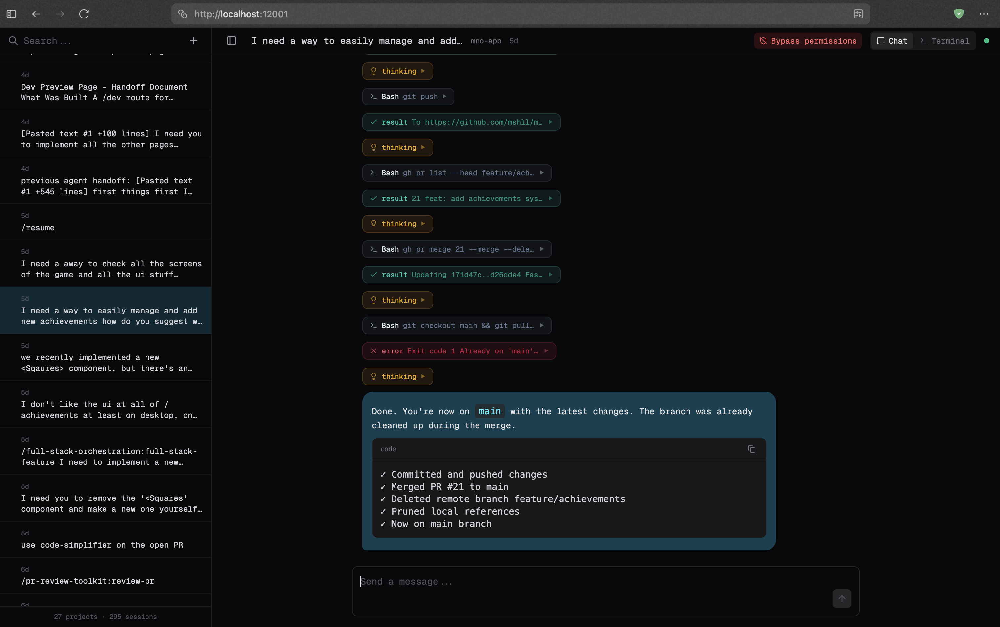
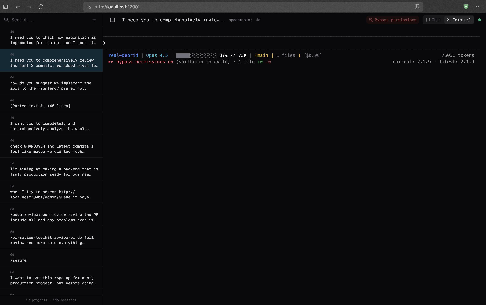

<div align="center">

# Claude Web UI

A web interface for Claude Code with full interactive capabilities

[](https://www.npmjs.com/package/claude-web-ui)
[](https://opensource.org/licenses/MIT)

</div>

<br />

```bash
npx claude-web-ui
```

| Chat Mode | Terminal Mode |
|-----------|---------------|
|  |  |

## Features

- **Interactive sessions** - Chat with Claude directly from the browser, resume existing sessions, or start new ones
- **Dual-mode interface** - Switch between chat mode (rendered markdown, collapsible tool calls) and terminal mode (full PTY with xterm.js)
- **Real-time streaming** - Watch responses stream in as Claude works
- **Session browser** - Browse and search all your Claude Code conversations, organized by project
- **Multi-tab support** - Work with multiple sessions across browser tabs
- **Bypass permissions** - Skip permission prompts for trusted workflows

## Installation

```bash
npm install -g claude-web-ui
```

Or run directly:

```bash
npx claude-web-ui
```

## Usage

```
claude-web-ui [options]

Options:
  -V, --version        Show version number
  -p, --port <number>  Port to listen on (default: 12001)
  -d, --dir <path>     Claude directory (default: ~/.claude)
  --no-open            Do not open browser automatically
  -h, --help           Show help
```

## Chat Mode vs Terminal Mode

**Chat Mode**: Messages rendered with syntax highlighting, collapsible tool calls, and markdown formatting. Best for reviewing conversations and seeing structured output.

**Terminal Mode**: Full terminal emulator showing raw CLI output with colors, prompts, and interactive elements. Best for workflows that require terminal interaction or when you need the complete CLI experience.

## Requirements

- Node.js 20+
- Claude Code CLI installed and authenticated

## Development

```bash
git clone https://github.com/mshll/claude-web-ui.git
cd claude-web-ui
pnpm install
pnpm dev
```

## Architecture

```
Browser ──WebSocket──▶ Backend ──spawn──▶ Claude CLI
   │                     │
   │◀──SSE streaming─────│◀──file watch──── ~/.claude/
```

- **Frontend**: React 19, Vite, Tailwind CSS, xterm.js
- **Backend**: Hono, node-pty, Chokidar
- **Protocol**: WebSocket for interactive sessions, SSE for history streaming

## License

MIT
